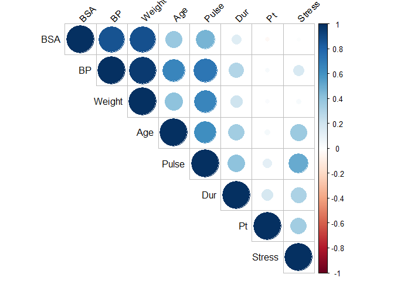
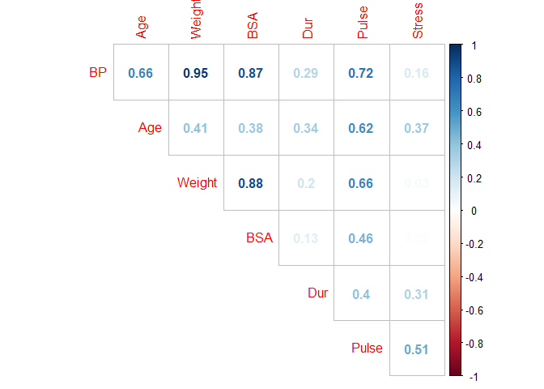

Longley
-------

``` r
library(datasets)
library(tidyverse)
```

    ## -- Attaching packages ---------------------------------------------------------------------------------------------------------------------------------------------- tidyverse 1.2.1 --

    ## v ggplot2 3.2.1     v purrr   0.3.3
    ## v tibble  2.1.3     v dplyr   0.8.3
    ## v tidyr   1.0.0     v stringr 1.4.0
    ## v readr   1.3.1     v forcats 0.4.0

    ## -- Conflicts ------------------------------------------------------------------------------------------------------------------------------------------------- tidyverse_conflicts() --
    ## x dplyr::filter() masks stats::filter()
    ## x dplyr::lag()    masks stats::lag()

``` r
library(broom)
library(viridis)
```

    ## Loading required package: viridisLite

``` r
library(GGally)
```

    ## 
    ## Attaching package: 'GGally'

    ## The following object is masked from 'package:dplyr':
    ## 
    ##     nasa

``` r
library(car)
```

    ## Loading required package: carData

    ## 
    ## Attaching package: 'car'

    ## The following object is masked from 'package:dplyr':
    ## 
    ##     recode

    ## The following object is masked from 'package:purrr':
    ## 
    ##     some

``` r
library(gridExtra)
```

    ## 
    ## Attaching package: 'gridExtra'

    ## The following object is masked from 'package:dplyr':
    ## 
    ##     combine

``` r
library(knitr)
library(corrplot)
```

    ## corrplot 0.84 loaded

``` r
df <- longley
str(df)
```

    ## 'data.frame':    16 obs. of  7 variables:
    ##  $ GNP.deflator: num  83 88.5 88.2 89.5 96.2 ...
    ##  $ GNP         : num  234 259 258 285 329 ...
    ##  $ Unemployed  : num  236 232 368 335 210 ...
    ##  $ Armed.Forces: num  159 146 162 165 310 ...
    ##  $ Population  : num  108 109 110 111 112 ...
    ##  $ Year        : int  1947 1948 1949 1950 1951 1952 1953 1954 1955 1956 ...
    ##  $ Employed    : num  60.3 61.1 60.2 61.2 63.2 ...

``` r
#ggpairs(df)
```

``` r
#now fitting a linear model
model1 <- lm(Employed ~ GNP + Unemployed + Armed.Forces + Population + Year, data = df)
vif(model1)
```

    ##          GNP   Unemployed Armed.Forces   Population         Year 
    ##  1034.217736    23.263435     3.152259   225.713446   732.642507

``` r
#now fitting a linear model again
model2 <- lm(Employed ~ Unemployed + Armed.Forces +Population + Year, data = df)

vif(model2)
```

    ##   Unemployed Armed.Forces   Population         Year 
    ##     3.354743     2.788548   112.423502   124.468560

``` r
#now fitting a linear model again
model3 <- lm(Employed ~ Unemployed + Armed.Forces +Population, data = df)

vif(model3)
```

    ##   Unemployed Armed.Forces   Population 
    ##     3.146686     1.918225     3.514335

Blood Pressure
--------------

``` r
bloodpress <- read.table("bloodpress.txt", header=T)
```

``` r
str(bloodpress)
```

    ## 'data.frame':    20 obs. of  8 variables:
    ##  $ Pt    : int  1 2 3 4 5 6 7 8 9 10 ...
    ##  $ BP    : int  105 115 116 117 112 121 121 110 110 114 ...
    ##  $ Age   : int  47 49 49 50 51 48 49 47 49 48 ...
    ##  $ Weight: num  85.4 94.2 95.3 94.7 89.4 99.5 99.8 90.9 89.2 92.7 ...
    ##  $ BSA   : num  1.75 2.1 1.98 2.01 1.89 2.25 2.25 1.9 1.83 2.07 ...
    ##  $ Dur   : num  5.1 3.8 8.2 5.8 7 9.3 2.5 6.2 7.1 5.6 ...
    ##  $ Pulse : int  63 70 72 73 72 71 69 66 69 64 ...
    ##  $ Stress: int  33 14 10 99 95 10 42 8 62 35 ...

``` r
cor(bloodpress)
```

    ##                 Pt         BP        Age     Weight         BSA       Dur
    ## Pt      1.00000000 0.03113499 0.04269354 0.02485650 -0.03128800 0.1762455
    ## BP      0.03113499 1.00000000 0.65909298 0.95006765  0.86587887 0.2928336
    ## Age     0.04269354 0.65909298 1.00000000 0.40734926  0.37845460 0.3437921
    ## Weight  0.02485650 0.95006765 0.40734926 1.00000000  0.87530481 0.2006496
    ## BSA    -0.03128800 0.86587887 0.37845460 0.87530481  1.00000000 0.1305400
    ## Dur     0.17624551 0.29283363 0.34379206 0.20064959  0.13054001 1.0000000
    ## Pulse   0.11228508 0.72141316 0.61876426 0.65933987  0.46481881 0.4015144
    ## Stress  0.34315169 0.16390139 0.36822369 0.03435475  0.01844634 0.3116398
    ##            Pulse     Stress
    ## Pt     0.1122851 0.34315169
    ## BP     0.7214132 0.16390139
    ## Age    0.6187643 0.36822369
    ## Weight 0.6593399 0.03435475
    ## BSA    0.4648188 0.01844634
    ## Dur    0.4015144 0.31163982
    ## Pulse  1.0000000 0.50631008
    ## Stress 0.5063101 1.00000000

``` r
corrplot(cor(bloodpress), type = "upper", order = "hclust", 
         tl.col = "black", tl.srt = 45)
```



``` r
model.1 <- lm(BP ~ Age + Weight + BSA + Dur + Pulse + Stress, data = bloodpress)
car::vif(model.1)
```

    ##      Age   Weight      BSA      Dur    Pulse   Stress 
    ## 1.762807 8.417035 5.328751 1.237309 4.413575 1.834845

``` r
model.2 <- lm(BP ~ Age +  BSA + Dur + Pulse + Stress, data = bloodpress)
car::vif(model.2)
```

    ##      Age      BSA      Dur    Pulse   Stress 
    ## 1.703115 1.428349 1.237151 2.360939 1.502936

``` r
head(bloodpress)
```

    ##   Pt  BP Age Weight  BSA Dur Pulse Stress
    ## 1  1 105  47   85.4 1.75 5.1    63     33
    ## 2  2 115  49   94.2 2.10 3.8    70     14
    ## 3  3 116  49   95.3 1.98 8.2    72     10
    ## 4  4 117  50   94.7 2.01 5.8    73     99
    ## 5  5 112  51   89.4 1.89 7.0    72     95
    ## 6  6 121  48   99.5 2.25 9.3    71     10

``` r
#plot(bloodpress[, -1])
corrplot(cor(bloodpress[, -1]), method = "number", type = "upper", diag = FALSE)
```



``` r
summary(bloodpress.lm <- lm(BP ~ . - Pt, data = bloodpress))
```

    ## 
    ## Call:
    ## lm(formula = BP ~ . - Pt, data = bloodpress)
    ## 
    ## Residuals:
    ##      Min       1Q   Median       3Q      Max 
    ## -0.93213 -0.11314  0.03064  0.21834  0.48454 
    ## 
    ## Coefficients:
    ##               Estimate Std. Error t value Pr(>|t|)    
    ## (Intercept) -12.870476   2.556650  -5.034 0.000229 ***
    ## Age           0.703259   0.049606  14.177 2.76e-09 ***
    ## Weight        0.969920   0.063108  15.369 1.02e-09 ***
    ## BSA           3.776491   1.580151   2.390 0.032694 *  
    ## Dur           0.068383   0.048441   1.412 0.181534    
    ## Pulse        -0.084485   0.051609  -1.637 0.125594    
    ## Stress        0.005572   0.003412   1.633 0.126491    
    ## ---
    ## Signif. codes:  0 '***' 0.001 '**' 0.01 '*' 0.05 '.' 0.1 ' ' 1
    ## 
    ## Residual standard error: 0.4072 on 13 degrees of freedom
    ## Multiple R-squared:  0.9962, Adjusted R-squared:  0.9944 
    ## F-statistic: 560.6 on 6 and 13 DF,  p-value: 6.395e-15

``` r
round(vif(bloodpress.lm),2)
```

    ##    Age Weight    BSA    Dur  Pulse Stress 
    ##   1.76   8.42   5.33   1.24   4.41   1.83

``` r
summary(bloodpress.lm2 <- lm(BP ~ . - Pt - BSA, data = bloodpress))
```

    ## 
    ## Call:
    ## lm(formula = BP ~ . - Pt - BSA, data = bloodpress)
    ## 
    ## Residuals:
    ##      Min       1Q   Median       3Q      Max 
    ## -1.02600 -0.18526 -0.00077  0.21934  0.72533 
    ## 
    ## Coefficients:
    ##               Estimate Std. Error t value Pr(>|t|)    
    ## (Intercept) -15.116781   2.748758  -5.499 7.83e-05 ***
    ## Age           0.731940   0.055646  13.154 2.85e-09 ***
    ## Weight        1.098958   0.037773  29.093 6.37e-14 ***
    ## Dur           0.064105   0.055965   1.145   0.2712    
    ## Pulse        -0.137444   0.053885  -2.551   0.0231 *  
    ## Stress        0.007429   0.003841   1.934   0.0736 .  
    ## ---
    ## Signif. codes:  0 '***' 0.001 '**' 0.01 '*' 0.05 '.' 0.1 ' ' 1
    ## 
    ## Residual standard error: 0.4708 on 14 degrees of freedom
    ## Multiple R-squared:  0.9945, Adjusted R-squared:  0.9925 
    ## F-statistic: 502.5 on 5 and 14 DF,  p-value: 2.835e-15

``` r
round(vif(bloodpress.lm2),2)
```

    ##    Age Weight    Dur  Pulse Stress 
    ##   1.66   2.26   1.24   3.60   1.74
